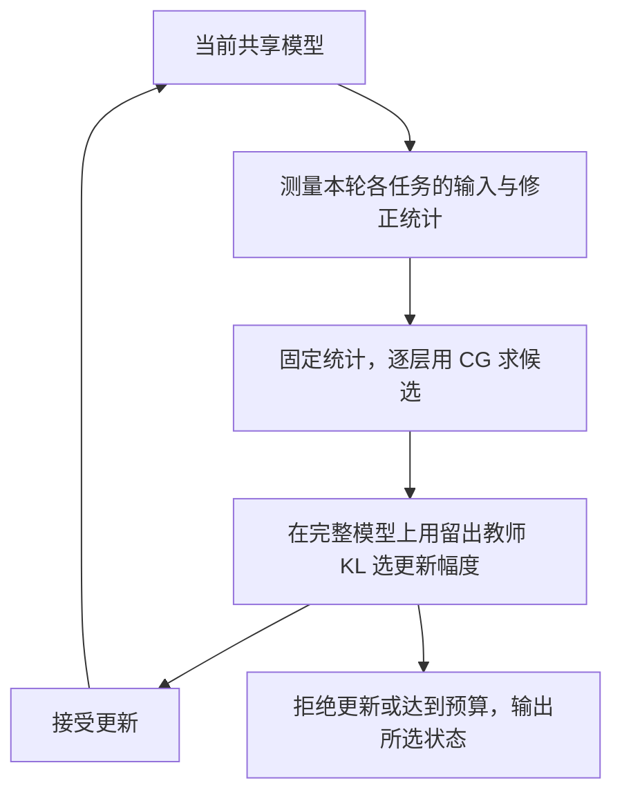

# RegMean 与 CM：我们究竟在解什么方程，又怎样求解？

日期：2026-09-17。本文是一份从基本线性代数出发的说明，不改变实验配置。先讨论一层的权重，最后再放回整个神经网络。

阅读顺序：先看第 1–5 节理解方程；再看第 6–9 节理解求解和迭代；第 10 节对应当前代码，第 11 节说明目标插值。

## 1. 先看最朴素的形式

普通的一元一次方程是：

$$
a x=b.
$$

有很多未知数时，它变成线性方程组：

$$
M\mathbf{x}=\mathbf{b}.
$$

我们要合并一层的权重，也是在解这样的线性问题，只是通常保留未知量的矩阵形状，记成 $X$。

**RegMean 的基本形式：**

$$
\boxed{\left(\sum_{t=1}^{T}A_t\right)X
=\sum_{t=1}^{T}A_tW_t.}
$$

**默认 CM 在一轮内的基本形式：**

$$
\boxed{\sum_{t=1}^{T}A_tXG_t
=\sum_{t=1}^{T}A_tW_tG_t.}
$$

这里 $W_t$ 是固定的第 $t$ 个专家的层权重，$X$ 是待求的共享候选权重。两种方法都把多个专家的要求汇总起来，求一个折中解。

这些是**逐层代理目标的最优性条件**。实际只执行有限步求解时，得到的是近似解；CM 随后还会选择接受多少候选更新。

## 2. 用只有一个权重的例子理解“合并”

假设只有两个专家，第一个希望权重接近 2，第二个希望接近 6；我们对第一个要求的重视程度是第二个的三倍。

可以定义：

$$
\min_x\ \frac12\left[3(x-2)^2+(x-6)^2\right].
$$

最优点满足：

$$
3(x-2)+(x-6)=0,
\qquad
(3+1)x=3\cdot2+1\cdot6,
\qquad
x=3.
$$

注意两件事：

- 不是同时要求 $x=2$ 和 $x=6$，而是让两项要求的总体误差尽量小。
- 权重系数同时出现在未知量和专家参照上，因为我们衡量的是**二者之差**。

RegMean、CM 把这个例子扩展到整张权重矩阵，并允许不同输入方向、输出方向的重要性不同。

## 3. 先固定符号与矩阵形状

以下采用“样本按行、权重按输入维度到输出维度排列”的约定。

| 符号 | 形状 | 含义 |
|---|---|---|
| $X$ | $d_{\rm in}\times d_{\rm out}$ | 本轮要解出的候选层权重 |
| $W_t$ | $d_{\rm in}\times d_{\rm out}$ | 第 $t$ 个专家的固定层权重 |
| $W^{(r)}$ | $d_{\rm in}\times d_{\rm out}$ | 第 $r$ 轮开始时，当前学生的层权重 |
| $Z_t$ | $n_t\times d_{\rm in}$ | 某一来源模型在任务数据上的层输入，样本按行排列 |
| $A_t$ | $d_{\rm in}\times d_{\rm in}$ | 输入侧统计 / 度量 |
| $G_t$ | $d_{\rm out}\times d_{\rm out}$ | 输出侧统计 / 度量 |
| $B$ | $d_{\rm in}\times d_{\rm out}$ | 求解前已算好的右端项 |

在这个约定下，线性层输出写成 $Z_tX$。暂时省略偏置、LayerNorm 等不参与此方程的参数。

**与 PyTorch 对照：**`nn.Linear.weight` 通常按 `[输出维度, 输入维度]` 存储，因此代码先转置再求解，写回时再转置。转置约定不同，不代表方法不同。

还要区分两个位置：$W^{(r)}$ 决定当前在哪里测量统计，$X$ 是测完以后要求解的候选。一次内层求解期间，统计固定，不随 CG 临时生成的 $X$ 重新采集。

## 4. RegMean：从输出拟合到矩阵方程

### 4.1 先定义想最小化的误差

第 $t$ 个专家的层输入是 $Z_t$。在这批相同的输入上，候选层输出为 $Z_tX$，专家层输出为 $Z_tW_t$。

为便于说明，下面采用任务内平均、任务间等权的版本：

$$
Q_{\rm reg}(X)
=\frac12\sum_t\frac{1}{n_t}
\left\|Z_tX-Z_tW_t\right\|_F^2.
$$

$\|\cdot\|_F^2$ 就是把矩阵中每个元素的平方相加。这个目标要求候选层尽量复现各专家在对应输入上的线性响应。

定义输入 Gram 的平均：

$$
A_t=\frac{1}{n_t}Z_t^\top Z_t.
$$

它是未减均值的二阶矩；项目中有时也宽泛地称为输入协方差。对候选权重的梯度为：

$$
\nabla_X Q_{\rm reg}(X)=\sum_t A_t(X-W_t).
$$

令梯度为零，得到：

$$
\underbrace{\left(\sum_t A_t\right)}_{M}X
=\underbrace{\sum_t A_tW_t}_{B}.
$$

于是 RegMean 可以写成 **$MX=B$**：系数矩阵 $M$ 相同，$X$ 的每一列对应一组右端向量。

原论文使用输入内积矩阵构造回归，并在 Transformer 实现中衰减非对角项。上面的归一化方式是本文为解释任务等权而明确采用的约定；若直接累加未归一化的 Gram，样本数不同的任务会获得不同的隐含权重。[RegMean 原文，第 3.2–3.3 节](https://arxiv.org/html/2212.09849v6#S3.SS2)

### 4.2 怎么解？

若 $M$ 可逆，形式上可以写：

$$
X=M^{-1}B.
$$

程序通常直接求解线性系统：

```python
M = sum(A_list)
B = sum(A @ W for A, W in zip(A_list, W_list))
X = torch.linalg.solve(M, B)
```

`solve` 不要求先显式计算逆矩阵；这里每个输出通道相当于一个右端列，可以共用矩阵分解。PyTorch 也建议用直接求解代替显式求逆后相乘。[PyTorch `solve` 文档](https://docs.pytorch.org/docs/2.8/generated/torch.linalg.solve.html)

常见数值选择如下：

| 条件 | 常见方式 | 需要注意 |
|---|---|---|
| 方阵可逆，规模适中 | LU 分解 / 通用 `solve` | 病态时仍会敏感，不因使用 `solve` 自动消除噪声 |
| 对称正定 | Cholesky 分解后求解 | 必须满足正定条件 |
| 保留了原始输入和目标矩阵 | QR 或 SVD 最小二乘 | 可以直接解回归，避免形成正规方程带来的条件数放大 |
| 秩不足 | SVD / 伪逆，或有明确依据的正则化 | 伪逆选取的解与保留当前权重的解可能不同；阈值也会影响结果 |
| 系统大，适合迭代处理 | CG 等迭代求解 | RegMean 也可以用 CG，算法名称不限定求解器 |

“有闭式表达式”和“实际构造逆矩阵”是两件事；“使用迭代求解器”和“改变回归目标”也是两件事。

## 5. CM：给误差再加一侧方向权重

### 5.1 单轮代理目标

把一轮内处理好的 A、G 看作固定的对称半正定矩阵，可以定义：

$$
Q_r(X)=\frac12\sum_t
\left\|
(A_t^{(r)})^{1/2}(X-W_t)(G_t^{(r)})^{1/2}
\right\|_F^2.
$$

这里的平方根用于表达加权误差，**不表示程序真的需要构造这些矩阵平方根**。

- A 决定哪些输入方向上的权重偏差更重要。
- G 决定哪些输出方向上的偏差更重要。
- 专家权重仍是固定参照。

在默认 CM 中，A 来自当前学生输入；G 来自当前师生预测分歧的归一化反传修正统计。G 不是直接写回权重的梯度，也不能自动等同于普通 Fisher 或真实损失 Hessian。

省略轮次上标，梯度为：

$$
\nabla_XQ_r(X)=\sum_t A_t(X-W_t)G_t.
$$

因此候选的求解条件是：

$$
\sum_t A_tXG_t=\sum_t A_tW_tG_t.
$$

这解释了为什么默认方法两边使用同一套统计：它们共同度量候选与专家的偏差。把右侧单独换成专家的另一套统计，会改变这个目标。

### 5.2 它与 RegMean 的关系

如果令所有输出侧度量为单位矩阵，就得到 RegMean 形式的输入侧回归方程。

但完整方法还取决于输入统计来自哪里、怎样归一化、是否更新统计、如何处理其他参数和选择候选。因此，只能说**求解结构退化到输入侧回归**，不能说整个 CM 自动变成论文中的完整 RegMean。

这种双侧拟合与用 CG 求解的框架在 MaTS 中已有明确构造；CM 的当前模型统计和外层反馈需要另外说明。[MaTS 原文，第 5.2 节](https://arxiv.org/html/2312.04339v2#S5.SS2)

### 5.3 为什么不能把 A、G 消掉？

真实系统包含多个任务的求和，每个任务的统计都可能不同。一般情况下：

$$
\sum_t A_tXG_t
\ne
\left(\sum_t A_t\right)X\left(\sum_t G_t\right).
$$

后一个表达式会多出不同任务之间的交叉项，已经改变了问题。

只有单专家、且相关矩阵可逆等特殊情况下，才可以直接消去两侧因子并恢复该专家权重。一般的多专家合并不属于这种情况。

## 6. CM 的方程也能变回普通线性方程组

定义一个作用在矩阵上的线性算子：

$$
\mathcal L(X)=\sum_t A_tXG_t,
\qquad
B=\sum_t A_tW_tG_t.
$$

CM 的内层任务就是：

$$
\mathcal L(X)=B.
$$

如果把矩阵按列展开成向量，记为 $\operatorname{vec}$，则：

$$
\mathbf x=\operatorname{vec}(X),\qquad
\mathbf b=\operatorname{vec}(B),\qquad
M=\sum_t G_t^\top\otimes A_t,
$$

$$
M\mathbf x=\mathbf b.
$$

$\otimes$ 表示 Kronecker 积；这里只需要把它理解成一种把左右两次矩阵作用组合为一次大矩阵作用的记法。

**所以 CM 的内层仍然是线性系统。** 它对本轮未知的候选 $X$ 是线性的；A、G 随外层模型状态变化，并不意味着必须在这次内层求解中把它们也当未知量。

如果 $M$ 可逆，它同样存在形式上的逆矩阵表达式。困难是显式构造、分解这个矩阵往往不划算，不是“数学上没有解的表达式”。

例如，一层有 $1024\times1024$ 个权重，展开后有 1,048,576 个未知数。完整 $M$ 有约一万亿个元素，仅 float32 存储就需要 **4 TiB**，尚未计算分解过程的额外内存。

因此实际保留 $X$ 的小矩阵形状，只提供：

```python
def apply_operator(X):
    return sum(A @ X @ G for A, G in zip(A_list, G_list))
```

这就是不显式构造大系统矩阵的求解方式。A、G 本身仍需要存储或分块处理，“不构造大矩阵”不代表没有统计存储开销。

## 7. 共轭梯度：只靠“算子作用”逐步逼近解

CG 不需要拿到完整的 $M$；能计算 $\mathcal L(X)$，就能执行迭代。

### 7.1 它反复检查的是方程残差

给定当前内层候选 $X_k$，计算：

$$
R_k=B-\mathcal L(X_k).
$$

残差衡量这个候选还没有满足方程的程度。CG 根据残差与之前的搜索方向，构造新的共轭方向，再计算该方向的步长，更新候选。

可以把流程读成：

1. 选定求解初值。
2. 用算子计算残差。
3. 根据残差和历史搜索方向确定下一步。
4. 更新候选及残差。
5. 残差足够小或预算用尽时停止。

普通梯度下降和 CG 都可以迭代，但 CG 利用固定线性系统的结构组织搜索方向；它不是对整张神经网络重新做一次训练。

### 7.2 预条件在做什么？

不同权重方向的数值尺度可能相差很大。当前实现使用系统的对角近似，先调整残差各个位置的尺度：

$$
D_{ij}=\sum_t(A_t)_{ii}(G_t)_{jj},
\qquad
U_k=R_k\oslash\max(D,\varepsilon).
$$

$\oslash$ 是逐元素除法。这里的 $U_k$ 是预条件后的残差，只属于求解器内部。

预条件的目的是让迭代更有效率。把对角预条件中的小数截住，并不等于给原方程添加了 ridge 正则；它也不保证原系统变成严格正定。

### 7.3 什么时候适合用 CG？

标准 CG 最直接的保证适用于对称正定系统。我们的双侧算子在 A、G 对称半正定时也是自伴、半正定的，因为：

$$
\langle V,\mathcal L(V)\rangle_F
=\sum_t\left\|A_t^{1/2}VG_t^{1/2}\right\|_F^2\ge0.
$$

只有有效统计覆盖了全部待求方向，才进一步严格正定。若有不可见方向，解可能不唯一；相容的半正定系统仍可以使用 CG，但有限精度、停止条件和未受约束的分量都要注意。[SciPy CG 的条件与算子接口](https://docs.scipy.org/doc/scipy/reference/generated/scipy.sparse.linalg.cg.html)

当前正式 CM 实验配置最多执行 100 次 CG，使用相对残差容差；不保证每一层都精确收敛。统计病态时，多解几步不一定改善最终模型表现。

## 8. 病态时，几种处理方式不能混为一谈

| 处理 | 改了什么 | 是否改变所求目标 |
|---|---|---|
| 用 `solve` 替代显式求逆 | 数值实现 | 理想精确算术下不改变 |
| 使用预条件 | 迭代中的搜索尺度 | 精确求解目标不变；固定步数时近似结果可不同 |
| 改 CG 初值 / 限制 CG 步数 | 求解轨迹与终止位置 | 方程不变，但有限步结果可能改变 |
| Gram 非对角衰减 / 输出统计收缩 | 实际采用的 A、G | 改变度量和代理目标 |
| 添加 ridge 或参考点约束 | 方程及右端 | 改变目标，且必须明确约束中心 |
| 使用伪逆 | 对小奇异值的处理和非唯一解的选择 | 可能改变保留的信息及所选解 |

例如，在 CM 目标上额外加入一个参考点约束：

$$
\frac{\lambda}{2}\|X-X_{\rm ref}\|_F^2,
$$

新方程是：

$$
\mathcal L(X)+\lambda X=B+\lambda X_{\rm ref}.
$$

如果只在左侧加 $\lambda X$ 而不改变右侧，对应的是向零权重收缩，和向当前权重收缩不是同一件事。这里介绍的是一般选项，**不表示当前主方法默认增加了这个正则项**。

有限校准下，统计可能秩不足或病态。秩上限由实际累积的特征行决定；一张图像或一句话有多个 patch/token，不能简单把“256 张图片”当成“输入 Gram 的秩至多 256”。

## 9. 内层 CG 与外层 CM 是两种迭代

| 层次 | 固定什么 | 更新什么 | 停止 / 选择依据 |
|---|---|---|---|
| 内层 CG | 本轮 A、G、专家权重、右端 | 某层的候选权重 | 线性系统残差及求解预算 |
| 外层 CM | 专家模型、校准与留出样本 | 共享模型状态；随后重测统计 | 留出教师 KL、拒绝规则及轮数预算 |



设内层给出 $\widehat X^{(r)}$，只接受一部分更新时，写回的是：

$$
W^{(r+1)}=W^{(r)}+\omega_r\bigl(\widehat X^{(r)}-W^{(r)}\bigr).
$$

因此，**接受后的权重不必精确满足刚才的层方程**。实际优先检查完整模型在留出集上的行为；下一轮又会使用新模型测得的统计。

正式 CLIP 还有逐块幅度选择，T5/LLM 的已用流程为全局选择，见 [协议对齐说明](PROTOCOL_ALIGNMENT.md)。上面的单个幅度用于说明，不能代替所有架构的完整搜索实现。

把同一轮 CG 从 100 次增加到更多次，是更充分地解当前问题；更新模型后重新采集 A、G，是构造下一轮问题。二者不能互相替代。这个逐层二次代理也不等于对完整网络 KL 直接执行 Newton 法。

## 10. 我们的代码具体对应哪一种？

以下路径相对实验工作区 `layer_wise_merging/`。代码核对日期为 2026-09-17；当前结果中仍存在实现版本差异。

| 入口 | 实际求解 | 内层初值 / 处理 |
|---|---|---|
| `github/src/ink_model_merging/model_merging_methods/activation_based.py` 的 `solve_regression_mean` | 非对角处理后的输入侧系统；`torch.linalg.solve` | 不使用 CG 初值 |
| `nlp/merge_t5.py` 的 `regmean_solve` | 输入侧系统；`torch.linalg.solve` | 对输入 Gram 做非对角衰减 |
| 同一 `activation_based.py` 的 `solve_kronecker_factored_regression` | 双侧矩阵算子；对角预条件 CG | 正式 CM 和 T5 调用传入当前权重；最多 100 步，调用处相对容差为百万分之一 |
| `wb/wbench/merge_data.py` 的 `mats_bfm` | 同类双侧算子；对角预条件 CG | 旧工作台 / LLM 的已用调用默认从专家平均权重开始 |
| `nlp/kfac_targets.py` 的 `solve_kfac_targets` | 目标插值扩展的双侧系统 | 当前权重作为 CG 初值；输出头使用输入侧 CG |

这里还有三个容易读错的地方：

- 某些旧代码把**输入 Gram** 的局部变量命名成 `G`；那不一定是本文的输出侧 G，要看形状和来源。
- T5 输出头的扩展文件顶部注释提到闭式解，但实际代码使用输入侧 CG；不能只读注释判断求解器。
- 正式求解器在默认 CM 配置下会对非零统计做尺度归一化，并对输出侧做自动收缩。求解方程里的 A、G 应理解为**实际处理后送入求解器的矩阵**。某任务在本层没有有效输出修正信号时，该任务不参与本层方程；若全部任务均无信号，则保留当前层权重。

初值差异不能一概视作只影响速度：在有限 CG 预算下结果可能不同；当系统不唯一时，统计没有约束的分量也可能保留初值中的信息。

## 11. 补充：目标插值为什么会改右端？

默认 CM 用同一套学生统计衡量候选和专家权重。目标插值另外引入专家自己的层输入。

对同一任务同一批样本，记学生输入为 $Z_{s,t}$、专家输入为 $Z_{e,t}$，构造目标输入：

$$
Z_{{\rm target},t}=(1-\alpha)Z_{s,t}+\alpha Z_{e,t}.
$$

在输出度量固定时，可以考虑拟合：

$$
\frac12\sum_t\frac1{n_t}
\left\|\left(Z_{s,t}X-Z_{{\rm target},t}W_t\right)G_t^{1/2}\right\|_F^2.
$$

对应输入统计和交叉统计为：

$$
A_t=\frac1{n_t}Z_{s,t}^{\top}Z_{s,t},
\qquad
C_t=\frac1{n_t}Z_{s,t}^{\top}Z_{{\rm target},t}.
$$

于是求解条件变成：

$$
\sum_t A_tXG_t=\sum_t C_tW_tG_t.
$$

两种端点的含义：

- $\alpha=0$：交叉统计退回学生输入统计，恢复默认目标的结构。
- $\alpha=1$：目标完全采用专家自身输入，但 C 仍是师生输入之间的交叉统计，**不是专家自己的输入 Gram**；G 仍沿用当前学生处的修正统计。

上面先展示原始统计的目标。当前 T5 实现还对 A、C 使用相同的输入尺度归一化，并处理 G；求解时须使用这些处理后的统计。目标插值是独立扩展，不是默认 CM 必需的一步。

## 12. 一个可以运行的小例子

配套脚本：[examples/linear_systems_demo.py](examples/linear_systems_demo.py)。只需要 PyTorch，从 `INK-ICLR` 仓库根目录运行，计算在 CPU 上完成：

```bash
python motivation_method/examples/linear_systems_demo.py
```

脚本用两个小型专家权重及人工构造的正定统计，核对：

1. RegMean 的直接求解与堆叠输入的最小二乘结果一致。
2. CM 的矩阵算子与显式 Kronecker 系统作用一致。
3. 对角预条件 CG 与小系统的直接求解结果一致。
4. 目标梯度与方程残差的符号关系正确；输出侧取单位矩阵时恢复输入侧回归。

显式大矩阵只为这个小例子作校验，真实模型不使用这种构造。示例检查说明的是代数与实现对应关系，不是模型准确率实验。

## 13. 读代码时的检查顺序

1. 哪个变量是未知候选，哪些已经固定？
2. A、G 在谁的网络上、用哪些数据采集？
3. 进入求解器前是否归一化、收缩或更改目标？
4. 系统只有输入侧作用，还是输入、输出两侧都有作用？
5. 实际用直接求解、伪逆还是 CG？初值、容差与预算是什么？
6. 求出的候选是否完整写回，还是经过留出选择后只接受一部分？

这些信息确定后，RegMean、默认 CM 和目标插值扩展各自在解什么，就能逐一对应到代码；不能只凭一个方程外形或一个函数名称判断完整算法。
